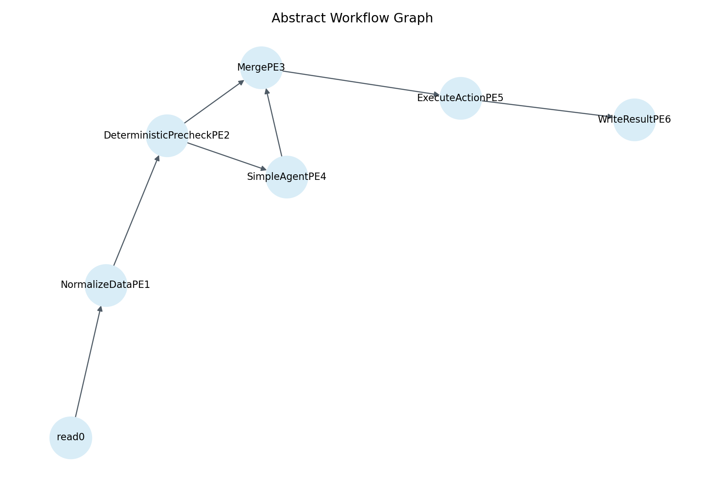
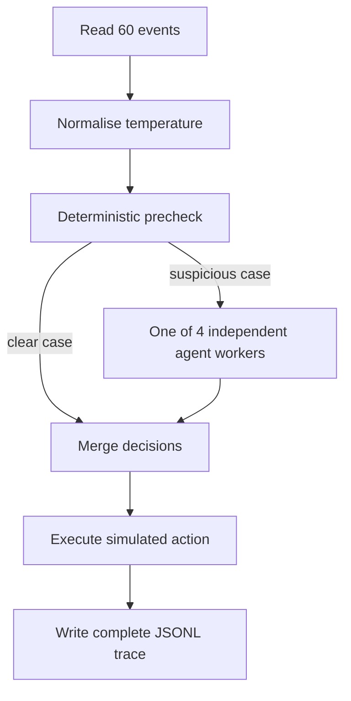

# Simplified dispel4py multi-worker agent workflow

## Explanation and trace analysis

This document explains the **simplified parallel multi-worker sensor workflow** implemented with dispel4py. It describes what the workflow receives, what it does, how the four agent workers operate, what is recorded in the traces, and what happened in the supplied run.

The runnable Google Colab notebook is:

<https://colab.research.google.com/drive/1a9uI09wOIrQzZcQL1DDoDPblBwB8TyAa?usp=sharing>

The supplied execution bundle contains the exact input, workflow code, output trace and dispel4py monitoring files analysed here.

> [!IMPORTANT]
> This is a **parallel multi-worker agentic workflow**, not a system in which agents collaborate with one another. There are four independent copies of the same Agent Processing Element (PE). They process different events, but they do not talk, share memory, delegate work or ask each other for data.

## 1. What are we demonstrating?

Imagine that a group of sensors continually reports:

- temperature;
- humidity;
- battery level; and
- a short diagnostic note.

The workflow must decide what to do with each reading.

Some cases are so clear that a fixed rule is enough. For example, a battery below 10% does not need an LLM to decide that maintenance is required. Other cases are less clear. A sudden temperature increase could mean a real environmental change, a calibration problem or a faulty sensor. Those cases are sent to an LLM agent that can inspect additional evidence before deciding.

This gives us a **hybrid workflow**:

- deterministic rules handle clear cases; and
- LLM agents handle suspicious or ambiguous cases.

All measurements, requests and maintenance tickets are synthetic or simulated. This is a teaching and tracing example, not a production sensor-control system.

## 2. The abstract workflow

The following figure was generated automatically by dispel4py monitoring during the supplied run.



The same workflow can be read more simply as follows:



### What each Processing Element does

| Processing Element | Processes | Plain-English purpose |
|---|---:|---|
| `read` | 1 | Reads the JSON input and emits the 60 events. |
| `NormalizeDataPE` | 3 | Adds `normalized_temperature`, calculated as temperature divided by 40. |
| `DeterministicPrecheckPE` | 3 | Applies the battery, temperature and clear-normal rules. |
| `SimpleAgentPE` | **4** | Independently assesses events that the rules cannot resolve. |
| `MergePE` | 2 | Rejoins deterministic and agent decisions into one stream. |
| `ExecuteActionPE` | 2 | Adds a plain-English outcome for the selected action. |
| `WriteResultPE` | 1 | Safely writes all final records to one JSONL file. |

There are **16 operating-system processes altogether**, but only four are LLM-agent workers.

## 3. The input data

### What one event contains

Each input event contains:

| Field | Meaning |
|---|---|
| `event_id` | Unique identifier for the event. |
| `sensor_id` | Sensor that produced the event. |
| `zone` | Location group used in this example. |
| `timestamp` | Synthetic event time. |
| `temperature` | Current temperature reading. |
| `humidity` | Current humidity reading. |
| `battery` | Current battery percentage. |
| `diagnostic_note` | Text describing routine operation or a possible problem. |
| `scenario_type` | The synthetic case used to create the event. |
| `expected_route` | Whether the experiment expects a rule or an agent to handle it. |
| `previous_readings` | Up to five earlier readings attached to this event. |
| `neighbour_readings` | Latest available readings from adjacent sensors, attached to this event. |

The random seed is fixed at 42, so the same synthetic dataset can be regenerated.

### What is different about this new dataset?

The previous multi-worker version contained 100 events, but only five reached an agent. Ninety-five events were resolved without one. This made it difficult to study agent behaviour or compare the four agent workers.

The simplified version deliberately balances the routes:

| Route | Scenario | Events |
|---|---|---:|
| Deterministic | Clearly normal | 20 |
| Deterministic | Battery below 10% | 5 |
| Deterministic | Impossible temperature | 5 |
| Agent | Packet loss | 5 |
| Agent | Calibration drift | 5 |
| Agent | Moisture or buzzing | 5 |
| Agent | Isolated temperature spike | 5 |
| Agent | Disagreement with neighbours | 5 |
| Agent | Intermittent fault | 5 |
| **Total** |  | **60** |

Therefore:

- 30 events are designed for deterministic handling;
- 30 events are designed for agent handling; and
- **50% of the input reaches an agent**, compared with 5% previously.

This is a better dataset for examining agent traces. It still retains clear examples in which an LLM is unnecessary.

### What do `previous_readings` and `neighbour_readings` mean?

They are **snapshots prepared before parallel execution**.

When an agent calls `compare_neighbours`, it does not contact another agent or a live sensor. The tool reads the `neighbour_readings` already stored inside its current event and calculates the differences.

```text
Dataset generator
    creates a self-contained event
    attaches previous and neighbouring readings
             ↓
One agent worker receives that event
             ↓
The local comparison tool reads the attached snapshot
             ↓
The result returns to the same agent worker
```

This makes events safe to process independently. The trade-off is that an agent cannot see a reading produced concurrently by another worker. A genuinely live lookup would require shared infrastructure such as a database, service or dedicated state PE.

## 4. How the precheck decides whether an agent is needed

The deterministic precheck applies the rules in this order:

1. **Battery precheck:** if battery is below 10%, choose `maintenance`.
2. **Temperature precheck:** if temperature is below -40°C or above 85°C, choose `human_review`.
3. **Clear-normal precheck:** if the note explicitly says that this is a routine, stable reading, choose `accept`.
4. **Otherwise:** route the event to an agent.

The first three paths are deliberately simple and transparent. They save model calls and keep clear safety rules outside the LLM.

The `scenario_type` does not directly tell the precheck what action to take. It is metadata used to understand the synthetic experiment. The actual routing is based on battery, temperature and diagnostic text.

## 5. What an agent can do

Each suspicious event is assigned to **one** of the four independent agent workers. The agent can request these bounded tools:

| Tool | What it really does |
|---|---|
| `inspect_previous_readings` | Returns the history snapshot already attached to the event. |
| `compare_neighbours` | Compares the current reading with attached neighbouring readings. |
| `request_measurement` | Creates a simulated request for another reading. |
| `create_maintenance_ticket` | Creates a simulated maintenance ticket. |
| `escalate_to_human` | Creates a simulated human-review request. |
| `submit_final_decision` | Finishes the agent loop with an action and reason. |

The agent can select one of five final actions:

| Action | Meaning |
|---|---|
| `accept` | Store the reading as valid. |
| `retry` | Request another measurement. |
| `maintenance` | Start the maintenance workflow. |
| `notify_operator` | Notify an operator. This remains an allowed final action, although no event selected it in this run. |
| `human_review` | Send the case to a person for review. |

An important distinction is that **tools describe work performed during reasoning**, whereas the final action describes the agent's final disposition of the event. An agent may inspect two evidence sources, create a maintenance ticket and then decide that a person should review the case. The trace preserves all of those steps.

## 6. What changed from the previous multi-worker version?

| Property | Previous multi version | Simplified multi version |
|---|---|---|
| Input events | 100 | 60 |
| Agent-routed events | 5 (5%) | 30 (50%) |
| Deterministic events | 95 (95%) | 30 (50%) |
| Suspicious scenario design | A few anomalies inserted at selected event numbers | Six named scenarios, five events each |
| Agent workers | 4 independent workers | 4 independent workers |
| Total processes | 16 | 16 |
| Agent PE | `ParallelLLMSensorAgentPE` | Shorter `SimpleAgentPE` |
| Code organisation | Tool schema, execution and loop were lengthy and intertwined | Tool helper, `run_tool`, `run_agent` and `_process` have clear roles |
| Route metadata | Route inferred mainly from decision source | Every input states `scenario_type` and `expected_route` |
| Routing trace | Mostly audit messages | Structured `routing_trace` plus audit messages |
| Agent trace | Flat executed-tool trace | Round-by-round `agent_trace` plus flat `tool_trace` |
| Agent utilisation in supplied run | One worker received no agent events | All four processed 7–8 agent events |

The architecture has not been changed into a communicating multi-agent system. The main improvements are **more useful input cases, simpler code and clearer evidence**.

## 7. What is recorded in the output traces?

The workflow produces two different trace layers. They answer different questions.

### 7.1 Semantic event and agent trace

`multi_agent_results.jsonl` contains one complete JSON record per final event. It explains **what happened to the event and why**.

Important fields include:

| Trace field | Question answered |
|---|---|
| Input fields | What measurements and diagnostic note arrived? |
| `scenario_type` | Which synthetic case produced this event? |
| `expected_route` | Was this designed as a deterministic or agent case? |
| `routing_trace` | Which precheck rule matched, or why was the event sent to an agent? |
| `decision_source` | Did a rule, agent or error fallback make the decision? |
| `agent_trace` | What happened in every agent round, including the final-decision call? |
| `tool_trace` | Which non-final tools actually ran, with arguments and results? |
| `worker_pid` | Which process handled the final decision? |
| `action` and `reason` | What final decision was made, and why? |
| `outcome` | What the simulated executor did with that action. |
| `audit` | How the event moved through the workflow stages. |

`agent_trace` and `tool_trace` overlap deliberately:

- use `agent_trace` to reconstruct the conversation round by round;
- use `tool_trace` for simple counting and aggregate analysis.

For deterministic events, both lists are empty because no agent ran.

### 7.2 dispel4py execution monitoring

The `monitoring/` directory explains **how the workflow executed** rather than why an agent made a decision.

It includes:

- per-PE timing summaries;
- per-process-instance counts and timings;
- per-iteration timings;
- abstract and concrete graph descriptions; and
- PNG images of the abstract and concrete workflow graphs.

The two layers should not be confused:

> The JSONL agent trace explains decisions and evidence. The dispel4py monitoring files explain execution, distribution and timing.

## 8. Analysis of the supplied run

### 8.1 Routing worked exactly as designed

All 60 events produced a result:

| Decision source | Events |
|---|---:|
| Deterministic rules | 30 |
| OpenAI agents | 30 |
| Agent-error fallback | 0 |

Every event followed its expected route. The 20 clear-normal, five low-battery and five impossible-temperature events were handled deterministically. All 30 suspicious events reached an agent.

This matters because the experiment now separates two questions cleanly:

1. **Was the correct kind of decision-maker used?** Yes: routing matched the experiment design for all 60 events.
2. **What did the agent decide after receiving a suspicious case?** The detailed trace lets us examine that separately.

### 8.2 Final actions

| Final action | Events | Explanation |
|---|---:|---|
| `accept` | 20 | All were clear, routine readings handled by a rule. |
| `maintenance` | 28 | Five low-battery cases plus 23 agent decisions. |
| `human_review` | 8 | Five impossible temperatures plus three agent decisions. |
| `retry` | 4 | Four packet-loss cases. |
| `notify_operator` | 0 | Allowed, but not selected. |

The final action distribution is not intended to be perfectly balanced. It reflects the deterministic rules and the agent's interpretation of the attached evidence.

### 8.3 Results by suspicious scenario

| Suspicious scenario | Agent decisions |
|---|---|
| Calibration drift | 5 maintenance |
| Intermittent fault | 5 maintenance |
| Packet loss | 4 retry; 1 maintenance |
| Isolated temperature spike | 4 maintenance; 1 human review |
| Neighbour disagreement | 4 maintenance; 1 human review |
| Moisture/buzzing | 4 maintenance; 1 human review |

This variation is useful. The route is deterministic, but the agent decision is contextual rather than hard-coded from `scenario_type`.

It also shows why the trace is necessary. If we only counted final actions, we would not know whether the agent inspected history, compared neighbours, requested another measurement or created a ticket first.

### 8.4 Tool use

The 30 agent events produced 98 agent rounds and 92 executed non-final tool calls.

| Tool | Calls |
|---|---:|
| `compare_neighbours` | 29 |
| `inspect_previous_readings` | 28 |
| `create_maintenance_ticket` | 26 |
| `request_measurement` | 6 |
| `escalate_to_human` | 3 |

Most agents inspected both history and neighbours before acting. One early event had very limited historical evidence and was handled with a maintenance ticket without the usual two evidence calls.

The six measurement requests are also informative:

- four were packet-loss cases that finished with `retry`;
- one packet-loss case requested another measurement but finally selected `maintenance`; and
- one calibration-drift case requested another measurement and created a maintenance ticket before selecting `maintenance`.

Similarly, the three events ending in agent-selected `human_review` also created maintenance tickets during their reasoning. This is not missing information: both operations are visible in the trace.

### 8.5 Agent rounds

| Rounds used | Events |
|---|---:|
| 2 rounds | 2 |
| 3 rounds | 19 |
| 4 rounds | 8 |
| 5 rounds | 1 |

Most events completed in three rounds. The longest case was a moisture/buzzing event that used five rounds before finishing with human review.

A round is not the same as a tool call. One response can request more than one tool, and the final-decision call is present in `agent_trace` but is not counted as an executed evidence/action tool in `tool_trace`.

### 8.6 Work distribution across the four agents

All four configured agent workers received work:

| Agent worker | Events |
|---|---:|
| Worker 1 | 7 |
| Worker 2 | 8 |
| Worker 3 | 8 |
| Worker 4 | 7 |

The actual process identifiers are run-specific, so the table uses neutral worker labels. The important result is the balanced 7/8/8/7 distribution.

This is a clear improvement over the earlier 100-event run. Only five events reached the agent branch there, and one of the four configured agent workers received no work. In this run, the larger suspicious subset exercises all four workers.

The workers still do not collaborate. Balanced utilisation means only that the 30 independent events were distributed across all four copies of the Agent PE.

### 8.7 Timing

The deterministic PEs completed their individual event operations in tiny fractions of a second. The Agent PE dominated the processing time because it made external model calls.

For the 30 agent events:

- mean Agent PE time per event: approximately **21.16 seconds**;
- median: approximately **19.56 seconds**;
- 95th percentile: approximately **29.77 seconds**; and
- maximum: approximately **35.38 seconds**.

The four agent workers accumulated approximately 137, 160, 168 and 169 seconds of work respectively. These values are **per-worker accumulated processing times**, not a single serial runtime that should be added to estimate elapsed wall-clock time. The workers operated in parallel.

### 8.8 No failures occurred

All 30 agent cases completed with `decision_source = openai_agent`. No event used `agent_error_fallback`.

The fallback remains important: if a model call, tool call or maximum-round limit fails, the workflow returns a traceable `human_review` result instead of silently losing the event.

## 9. What can we learn from the traces?

### The hybrid design reduces unnecessary LLM work

Half of the events were decided using simple rules. There is no benefit in asking an LLM whether a 5% battery requires attention or whether an explicitly stable routine reading can be accepted.

### Routing correctness is different from decision correctness

The `expected_route` tells us whether an agent should be involved. It does **not** define a gold-standard final action for every suspicious event.

We can therefore say that routing was correct for all 60 events. We should not claim 100% decision accuracy, because the dataset does not contain expert-labelled final actions for the 30 suspicious cases.

### The trace exposes agent variability

Events with the same scenario type did not always end with the same action. Four packet-loss cases chose retry and one chose maintenance. The ambiguous spike, moisture and neighbour cases were mostly sent to maintenance, with one of each sent to human review.

This is exactly the behaviour that a trace makes inspectable. A future evaluation could add an expert-approved action and compare the agent's final decision against it.

### A final action alone is not enough

Some agents performed several operations before their final decision. For example, an agent may request a new measurement, inspect neighbour evidence and then create a maintenance ticket. Looking only at `action = maintenance` would hide that path.

### The tools are local and bounded

No tool gives an agent arbitrary system access. Evidence tools read only the current event, and action tools create simulated records. This makes the example easier to audit and reason about.

## 10. Important limitations

- The data are synthetic.
- Previous and neighbour readings are precomputed snapshots, not live shared state.
- The four agents have the same role and instructions; there is no agent specialisation.
- The agents do not communicate or coordinate.
- The run demonstrates traceability, not validated diagnostic accuracy.
- Model responses may vary between runs even when the input is unchanged.
- A scenario name is not a clinical or engineering ground truth.
- Simulated tickets and measurement requests do not affect a real system.

## 11. Files in the execution bundle

| File or directory | Purpose |
|---|---|
| `sensor_data_multi_60.json` | The 60 self-contained input events. |
| `sensor_workflow_multi_simple.py` | Simplified dispel4py workflow generated by the notebook. |
| `multi_agent_results.jsonl` | Complete event, routing, agent, tool and audit traces. |
| `multi_agent_trace_summary.csv` | One-row-per-event summary for quick analysis. |
| `monitoring/` | dispel4py counts, timings, graph descriptions and workflow figures. |

## 12. Short summary

The simplified version retains the same 16-process parallel architecture and four independent agent workers, but it is much easier to understand and analyse. Its main changes are:

- a balanced dataset in which 30 of 60 events need an agent;
- six clearly named suspicious scenarios;
- a shorter and more readable Agent PE;
- explicit expected-route and structured routing traces;
- round-by-round agent traces;
- complete dispel4py execution monitoring; and
- enough agent work to exercise all four workers.

The supplied trace confirms that every event followed the intended deterministic-or-agent route, all four agent workers were used, and no agent call failed. It also exposes meaningful variation in how the agents handled suspicious evidence—precisely the behaviour that this tracing example is intended to make visible.
