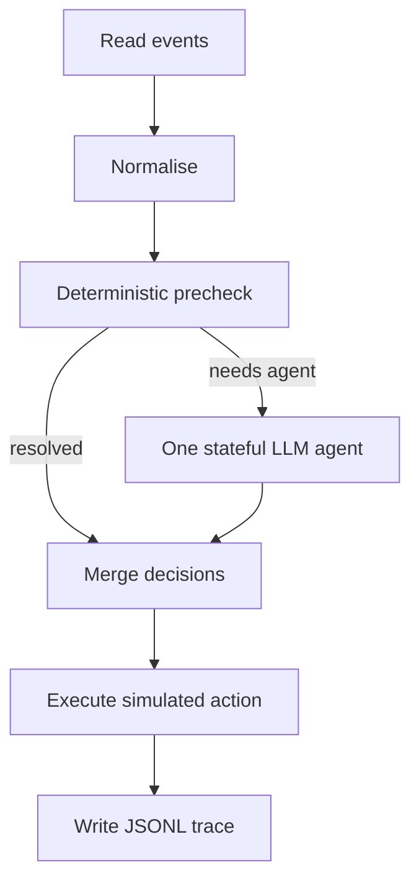

# Agentic AI workflows with dispel4py traces and monitoring

This repository contains two versions of an agentic sensor workflow implemented with [dispel4py](https://github.com/StreamingFlow/d4py):

1. a **simple, stateful workflow** for understanding one agent in detail; and
2. a **multi-process workflow** for processing independent events concurrently.

Both versions produce:

- an **agent trace**, describing decisions and tool use; and
- a **dispel4py monitoring trace**, describing workflow execution and performance.

> [!IMPORTANT]
> The second version is a **parallel multi-worker agentic workflow**, not a communicating multi-agent system. It runs four independent process instances of the same LLM-agent PE. These workers do not talk to one another, exchange messages, share memory, delegate tasks, or request readings from one another. Each worker receives a self-contained event with its required historical and neighbouring-sensor evidence already attached.

The complete runnable Google Colab notebook is:

<https://colab.research.google.com/drive/1asiWZ_I_8HCmFbbh2YmSqAAUQ3gbfq03?usp=sharing>

It is a monitored, streamlined iteration of the original agentic workflow notebook:

<https://colab.research.google.com/drive/19EQjfyBnW3I2lCWD0oO2Udp3kq5rom8v?usp=sharing>

## 1. What problem are we demonstrating?

The input is a stream of synthetic sensor events. Each event contains a temperature, humidity, battery level and diagnostic note. The workflow must select one bounded action:

| Action | Meaning |
|---|---|
| `accept` | Store the reading as valid. |
| `retry` | Request another measurement. |
| `maintenance` | Initiate the simulated maintenance workflow. |
| `notify_operator` | Notify an operator. |
| `human_review` | Send an ambiguous or safety-relevant case to a human. |

The workflow is **hybrid**. Fixed safety rules handle cases that do not need an LLM. An LLM agent handles events requiring contextual judgement and can call a restricted set of tools.

This is a teaching and tracing example. Measurements, tickets, notifications and requests are synthetic or simulated; it is not a production control system.

## 2. How the project evolved

### Iteration 1: agentic workflow

The original notebook introduced a dispel4py sensor workflow containing a tool-using LLM Processing Element (PE). It demonstrated decisions and tool calls, but it ran with the ordinary `simple` and `multi` mappings.

### Iteration 2: monitored simple workflow

The simple workflow now runs with `timed_simple`. It records both:

- the semantic agent trace in `agentic_sensor_results.jsonl`; and
- dispel4py timing and graph information in `monitoring_simple/`.

### Iteration 3: monitored parallel multi-worker workflow

The parallel-safe workflow now runs with `timed_multi -n 16`. It records:

- decisions, tool calls and worker IDs in `agentic_parallel_results.jsonl`; and
- process-level timing and graph information in `monitoring_multi/`.

This iteration lets us study both **what the agents decided** and **how the workflow executed**.

## 3. Version A: simple, stateful agent

### Input

`sensor_data_agentic.json` contains six events from four sensors.

### Workflow



The fixed precheck resolves:

- battery below 10% as `maintenance`; and
- temperature outside -40°C to 85°C as `human_review`.

Other events go to `LLMSensorAgentPE`. The agent can inspect earlier readings, compare neighbouring sensors, request a new measurement, create a maintenance ticket, notify an operator, escalate to a human, and submit a final decision.

### Why it is stateful

There is one LLM-agent PE instance. It keeps local in-memory collections containing:

- recent readings for each sensor;
- the latest reading from each sensor;
- simulated measurement requests;
- simulated maintenance tickets;
- simulated operator notifications; and
- simulated human-review items.

Events are processed sequentially, so later events can use evidence learned from earlier events.

### Number of agents

There is **one LLM agent** in the simple version. `timed_simple` uses one concrete instance of every PE; the supplied run therefore has seven PE instances in total, but only `LLMSensorAgentPE` is an LLM agent.

## 4. Version B: parallel multi-worker agentic workflow

This version parallelises the processing of independent events. Although it creates four LLM-agent worker processes, it is **not** a multi-agent collaboration architecture. The four workers are copies of the same `ParallelLLMSensorAgentPE`, with the same role, tools and instructions.

### Input

`sensor_data_parallel_100.json` contains 100 events from ten sensors. It is generated reproducibly with random seed 42.

Each event is self-contained and includes:

- its current sensor reading;
- a bounded list of `previous_readings`; and
- a bounded list of `neighbour_readings`.

### Why the problem changes in the multi version

Separate OS processes do not share the simple agent's Python memory. Letting each process build its own partial history would make the evidence depend on which worker happened to receive an event.

The multi version therefore prepares the historical and neighbouring evidence before execution and attaches it to every event. Each agent worker can make an independent decision using only its assigned event.

The workers:

- do **not** share an LLM conversation;
- do **not** share mutable agent memory;
- do **not** send evidence directly to one another; and
- do **not** split one event across several agents.

They also do **not** query one another when the LLM asks to inspect neighbouring sensors. That request is a local tool call, as explained below.

One event is handled by one agent worker when it reaches the agent branch.

### Workflow

The logical graph is the same hybrid pattern, but several PE stages have multiple process instances.

| Rank(s) | PE | Processes | Purpose |
|---|---|---:|---|
| 0 | `read` | 1 | Read and emit the 100 self-contained events. |
| 1–3 | `NormalizeDataPE` | 3 | Normalise events in parallel. |
| 4–6 | `DeterministicPrecheckPE` | 3 | Apply fixed rules and route events. |
| 7–8 | `DecisionMergePE` | 2 | Merge deterministic and agent decisions. |
| 9–12 | `ParallelLLMSensorAgentPE` | **4** | Run independent LLM-agent instances. |
| 13–14 | `ActionExecutorPE` | 2 | Attach the simulated outcome. |
| 15 | `ResultWriterPE` | 1 | Serialise all results safely into one JSONL file. |

### How many agents are there?

The multi workflow uses **16 worker processes in total**, but only **4 are LLM-agent workers**. The other 12 processes perform reading, normalisation, rule evaluation, merging, action execution and writing.

Therefore:

> **Multi workflow = 16 processes, including 4 independent LLM agents.**

### How are data shared between agents?

They are not shared between agents as common mutable state.

The reader emits complete event dictionaries. dispel4py distributes individual events among the available downstream instances. The supplied run shows this clearly:

- the 100 events were divided 34/33/33 across the three normalisation workers;
- they were then divided 34/33/33 across the three precheck workers;
- 95 events were resolved by deterministic rules;
- only five events entered the LLM-agent branch;
- those five events were processed 1/2/2/0 by agent ranks 9/10/11/12; and
- the single writer process collected all 100 final results in one file.

The fourth agent was available but idle because only five events required an LLM, and the routing of this small subset did not assign an event to rank 12. This is normal: configured capacity is not the same as work actually received.

The monitoring graph labels these default connections as `communication: "None"`. Here, that means no explicit content-based grouping was configured on the connections. It does **not** mean all workers receive copies of every event. The observed counts confirm that events were partitioned, not broadcast.

### What happens when an agent asks for a neighbour reading?

The agent calls the local Python tool `compare_neighbouring_sensors`. The tool does **not** contact a sensor, database, shared service or another agent. It reads the `neighbour_readings` list already stored inside the current event:

```text
Pre-generation step
    -> attaches previous_readings and neighbour_readings
Self-contained event
    -> assigned to one LLM-agent worker
compare_neighbouring_sensors tool
    -> reads that event's neighbour_readings locally
    -> calculates temperature and humidity differences
    -> returns the comparison to the same agent
```

For example, the event passed to one worker may already contain:

```json
{
  "event_id": "event-0021",
  "sensor_id": "sensor-001",
  "temperature": 31.0,
  "previous_readings": [],
  "neighbour_readings": [
    {
      "sensor_id": "sensor-002",
      "temperature": 22.1,
      "humidity": 43.0,
      "timestamp": "2026-08-06T09:20:00Z"
    }
  ]
}
```

The tool compares `31.0` with `22.1` and returns the calculated difference to the same worker. It is therefore retrieving a **precomputed snapshot embedded in the event**, not making a live or inter-agent request.

Consequences of this design:

- the neighbour snapshot reflects the information available when the dataset was generated;
- it cannot include a new reading produced concurrently by another worker;
- the four LLM workers remain fully independent; and
- adding a genuine live lookup would require shared infrastructure, such as a database, Redis service or dedicated state/evidence PE.

### What terminology should be used?

Use:

> **Parallel multi-worker agentic workflow with four independent LLM-agent workers.**

Avoid describing this implementation simply as a “multi-agent system,” because that commonly implies communication, coordination, role specialisation or shared state, none of which is implemented here.

## 5. Simple and multi versions compared

| Property | Simple version | Parallel multi-worker version |
|---|---|---|
| Input events | 6 | 100 |
| Sensors | 4 | 10 |
| Mapping | `timed_simple` | `timed_multi -n 16` |
| LLM agents | 1 | 4 |
| Total PE processes | 7 | 16 |
| Agent memory | Built progressively inside one agent | Precomputed evidence attached to each event |
| Event processing | Sequential | Concurrent across PE instances |
| Inter-agent state sharing | Not applicable | None |
| Inter-agent communication | Not applicable | None |
| Neighbour lookup | Reads state accumulated by the single agent | Reads the snapshot already attached to the assigned event |
| Agent trace | `agentic_sensor_results.jsonl` | `agentic_parallel_results.jsonl` |
| Monitoring directory | `monitoring_simple/` | `monitoring_multi/` |

## 6. Exactly what is traced

There are two trace layers. They answer different questions and should not be confused.

### 6.1 Agent-level trace: what happened to an event?

Each line of a JSONL file is one complete final event record.

#### Common event and decision fields

| Field | Captured information |
|---|---|
| `event_id` | Unique event identifier; present in the multi trace. |
| `sensor_id` | Sensor that produced the event. |
| `zone` | Sensor zone. |
| `timestamp` | Timestamp in the synthetic input event. |
| `temperature` | Original temperature measurement. |
| `normalized_temperature` | Temperature divided by 40. |
| `humidity` | Original humidity measurement. |
| `battery` | Battery percentage. |
| `diagnostic_note` | Text describing normal operation or a possible fault. |
| `previous_readings` | Historical evidence attached to a multi event. |
| `neighbour_readings` | Neighbour evidence attached to a multi event. |
| `action` | Final bounded action. |
| `reason` | Explanation accompanying the final decision. |
| `decision_source` | Whether the decision came from a rule, an LLM agent or an error fallback. |
| `outcome` | Human-readable description of the simulated action. |
| `worker_pid` | OS process that handled an LLM event in the multi workflow. |
| `audit` | Ordered workflow-level messages accumulated for the event. |
| `tool_trace` | Ordered list of tool interactions made by the LLM agent. |

`event_id`, `previous_readings`, `neighbour_readings` and `worker_pid` are specific to the multi-process design. A deterministic multi event normally has no `worker_pid`, because it never visits an LLM-agent process.

#### Every `tool_trace` entry

| Field | Captured information |
|---|---|
| `round` | Agent-loop round in which the tool was called. |
| `tool` | Tool name. |
| `arguments` | Arguments generated for the tool call. |
| `result` | Result returned by the deterministic Python tool. |
| `worker_pid` | Agent process executing the tool; multi trace only. |

The final `submit_final_decision` call is represented by the top-level `action` and `reason`; it is not added to `tool_trace` as an ordinary evidence/action tool.

#### Where the agent traces are stored

- Simple: `agentic_sensor_results.jsonl`
- Multi: `agentic_parallel_results.jsonl`

### 6.2 dispel4py monitoring: how did the workflow execute?

All monitoring filenames contain a UTC run ID such as `run20260915T213323534623Z`. This identifies which files belong to the same execution.

| File | Granularity | What it contains |
|---|---|---|
| `monitor_summary_run....csv` | Abstract PE | Ranks, processed count, total/average time, minimum, median, p95 and maximum. |
| `monitor_instances_run....csv` | Concrete PE instance | The same statistics for each PE/rank pair. |
| `monitor_iteration_timings_run....csv` | Individual iteration | Combined records of measured PE iterations. |
| `monitor_iteration_timings_summary_run....csv` | Concrete PE instance | Aggregated latency statistics calculated from iteration records. |
| `monitor_<PE>_rank<R>_run....csv` | Concrete PE instance | Small instance-level timing output. |
| `monitor_iterations_<PE>_rank<R>_run....csv` | Individual PE/rank | Raw iteration timing records for that instance. |
| `monitor_shape_run....json` | Abstract graph | Logical PEs and connections. |
| `monitor_concrete_shape_run....json` | Concrete graph | Process ranks, concrete instances and expanded connections. |
| `monitor_abstract_graph_run....png` | Abstract graph | Rendered logical workflow. |
| `monitor_concrete_graph_run....png` | Concrete graph | Rendered process-level workflow. |

The timing CSVs use these statistics:

| Column | Meaning |
|---|---|
| `total_count` / `iteration_count` | Number of measured PE executions. |
| `total_secs` | Sum of processing time. |
| `avg_secs` | Mean processing time. |
| `min_secs` | Minimum processing time. |
| `p50_secs` | Median processing time. |
| `p95_secs` | 95th-percentile processing time. |
| `max_secs` | Maximum processing time. |
| `rank` / `ranks` | Process rank or ranks assigned to the PE. |
| `instance_id` | Concrete identifier in the form `PE@rank`. |

Monitoring covers time spent inside PE processing methods. It is not a full distributed tracing system: it does not record network spans, OpenAI token usage, API cost, complete prompts/responses, or causal trace/span IDs across stages.

## 7. Analysis of the supplied traces

These results describe the supplied run. LLM decisions and timings may change on a later run.

### 7.1 Simple run

| Measure | Result |
|---|---:|
| Events written | 6 |
| Deterministic decisions | 1 |
| LLM-agent decisions | 5 |
| `accept` | 3 |
| `maintenance` | 3 |
| Tool calls | 13 |
| Agent errors/fallbacks | 0 |

Tools used:

| Tool | Calls |
|---|---:|
| `inspect_previous_readings` | 5 |
| `compare_neighbouring_sensors` | 5 |
| `create_maintenance_ticket` | 2 |
| `notify_operator` | 1 |

The single deterministic event was the low-battery case. The five remaining events went to the LLM agent.

The LLM PE processed five events in 86.38 seconds of summed PE processing time:

- mean: 17.28 seconds;
- median: 13.99 seconds;
- p95: 24.04 seconds; and
- maximum: 24.27 seconds.

All non-LLM stages took fractions of a millisecond per event. The external LLM interaction therefore dominates the measured processing time.

### 7.2 Multi run

| Measure | Result |
|---|---:|
| Events written | 100 |
| Deterministic decisions | 95 |
| LLM-agent decisions | 5 |
| `accept` | 94 |
| `retry` | 5 |
| `maintenance` | 1 |
| Tool calls | 15 |
| Agent errors/fallbacks | 0 |

Every LLM-routed event used the same three-tool pattern:

| Tool | Calls |
|---|---:|
| `inspect_previous_readings` | 5 |
| `compare_neighbouring_sensors` | 5 |
| `request_another_measurement` | 5 |

All five LLM events selected `retry`, which is consistent with the generated packet-loss cases. The one `maintenance` decision was produced by the deterministic low-battery rule.

The four configured agent ranks processed:

| Agent rank | LLM events | Total measured time | Mean per event |
|---:|---:|---:|---:|
| 9 | 1 | 15.94 s | 15.94 s |
| 10 | 2 | 36.69 s | 18.34 s |
| 11 | 2 | 33.08 s | 16.54 s |
| 12 | 0 | 0.00 s | — |

Across the five LLM events, summed processing time was 85.71 seconds, with a mean of 17.14 seconds and a maximum of 22.22 seconds. Because three agent workers operated concurrently, summed PE time must not be interpreted as end-to-end wall-clock runtime.

The deterministic stages were fast and well balanced:

- normalisation: 34/33/33 events;
- precheck: 34/33/33 events;
- merge: 50/50 events; and
- action execution: 50/50 events.

### 7.3 Main interpretation

The experiment demonstrates three useful points:

1. **Hybrid routing avoids unnecessary LLM work.** In the multi run, only 5% of events required an LLM.
2. **The LLM is the performance bottleneck.** Deterministic processing is measured in microseconds or milliseconds, while an LLM event takes roughly 14–22 seconds in this run.
3. **More configured agents do not guarantee that all are used.** Work depends on how many events reach the agent branch and how dispel4py routes that subset.

The simple and multi results should not be used as a direct speedup benchmark: they use different datasets and different deterministic prechecks. They demonstrate execution patterns, not a controlled performance comparison.

## 8. Repository contents

```text
.
├── README.md
├── dispel4py_agentic_ai_traces_monitoring.ipynb
├── agentic_sensor_results.jsonl
├── agentic_parallel_results.jsonl
├── sensor_data_agentic.json
├── sensor_data_parallel_100.json
├── sensor_workflow_agentic.py
├── sensor_workflow_agentic_parallel.py
├── monitoring_simple/
│   └── monitor_*
└── monitoring_multi/
    └── monitor_*
```

## 9. How to run it

The simplest route is to open the Colab notebook and select **Runtime → Run all**.

The notebook will:

1. clone and install the current `StreamingFlow/d4py` repository, including the timed mappings;
2. install `mpi4py`, `openai`, `pandas` and `matplotlib`;
3. request an OpenAI API key without displaying it;
4. create both synthetic datasets and workflow Python files;
5. run the simple workflow with `timed_simple`;
6. run the multi workflow with `timed_multi -n 16`;
7. analyse agent and monitoring traces; and
8. create `dispel4py_agentic_ai_traces.zip` for download.

The essential commands are:

```bash
dispel4py timed_simple /content/sensor_workflow_agentic.py \
  -d '{"read": [{"input": "/content/sensor_data_agentic.json"}]}' \
  --timing-dir /content/results/agentic_simple
```

```bash
dispel4py timed_multi /content/sensor_workflow_agentic_parallel.py \
  -n 16 \
  -d '{"read": [{"input": "/content/sensor_data_parallel_100.json"}]}' \
  --timing-dir /content/results/agentic_multi
```

## 10. Reproducibility and privacy notes

- The multi input dataset is reproducible because its generator uses random seed 42.
- LLM outputs can still vary between runs.
- The API key is held in the Colab runtime environment and is not written to the trace files.
- Complete prompts and model responses are not stored. The trace stores tool interactions and the final decision/reason.
- Synthetic sensor records may be shared for this demonstration, but the same design applied to real data would require a data-governance and redaction review.
- The workflow uses `store=False` for OpenAI Responses API calls.

## 11. Using the traces with WChef and WBench

The two trace layers provide complementary inputs for later experimentation:

- agent JSONL records describe event-level decisions and tool behaviour; and
- monitoring files describe workflow structure, process allocation and performance.

Before ingestion, confirm the schema required by WChef/WBench. A likely next step is to map these records into a common trace model with explicit fields for run, event, PE, worker, decision, tool call and timing. The current files intentionally preserve the native agent and dispel4py outputs so that this transformation remains transparent and reproducible.
